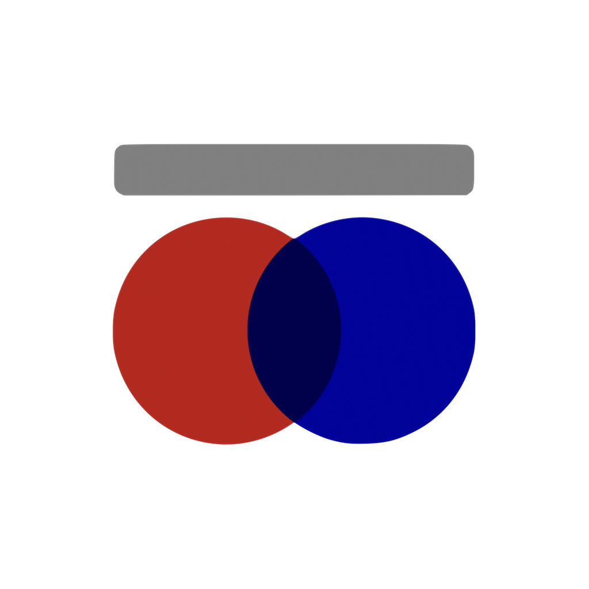

#  코젯 Koget

---

<h4 align="center">앱스토어에서 다운로드</h1>

 
 

### **📲 `코젯`은  iOS 잠금화면 바로가기 위젯입니다.**
---
자주 사용하는 앱이나 웹페이지를 추가하고, 잠금화면에서 바로 실행할 수 있습니다.   
코젯은 `URL(scheme)을 오픈`하여, 추가한 앱이나 웹페이지가 어디로 연결되는지 쉽게 확인할 수 있습니다.   
이를 통해 안전하고 확장성있게 코젯을 사용해 보세요.

- 위젯 아이콘과 URL도 내 마음대로 커스텀
- 유튜브 앱에서 가져온 영상URL로 영상 바로가기.
- 자신이 사용하고자 하는 앱이나 웹페이지 쉽게 설정
- 다양한 대한민국 앱과 글로벌 앱 탑재

  

### **🚀 최근 업데이트 소식**
---
**`1.2` 패치 노트 (출시 예정)**
- 이제 다크모드를 지원해요.
- 폰트가 변경되었어요.
- 패치 노트를 메인화면에 배치했어요.
- 리스트 뷰에서 좌/우측으로 밀기 기능이 추가되었어요

 

**`1.1` 패치 노트** 
- 영어(미국) 언어를 지원합니다.
- 약 20여가지 앱 리스트가 새로 추가되었어요.
- 아이콘뷰, 리스트뷰 두가지 사용이 가능해요.
- 이미지가 없어도 기본이미지로 위젯을 추가 할 수 있도록 변경했어요.
- 이제 앱에서 위젯을 실행할 수 있어요.
- 위젯 별 실행횟수를 확인 가능해요.
- 위젯 속성을 구분할수 있어요 (앱 위젯 & 웹페이지 위젯)   

