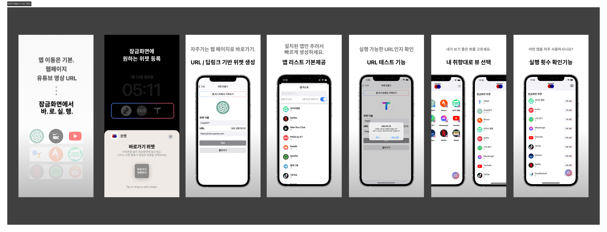

#  코젯 Koget

---

### **앱 미리보기 및 다운로드**

 

 

---

## **앱 소개**
---
### **📲 `코젯`은  iOS 잠금화면 바로가기 위젯입니다.**

잠금화면에 **앱, 웹페이지용 위젯을 만들고** 잠금화면에서 바로 실행.   
`URL(scheme)을 오픈`하여, 추가한 앱이나 웹페이지가 어디로 연결되는지 쉽게 확인할 수 있습니다.   
안전하고 빠르게 다양한 곳으로 이동해보세요!

 

> **주요 기능**
> - 위젯 아이콘과 URL 내 마음대로 커스텀
> - 유튜브 앱에서 가져온 영상 URL로 유튜브 영상 바로가기.
> - 어떠한 앱이나 웹페이지도 추가 가능
> - 다양한 대한민국 앱과 글로벌 앱 탑재

  

### **🚀 최근 업데이트 소식**
---
**`1.2` 패치 노트 (출시 예정)**
- 이제 다크모드를 지원해요.
- 폰트가 변경되었어요.
- 패치 노트를 메인화면에 배치했어요.
- 리스트 뷰에서 좌/우측으로 밀기 기능이 추가되었어요

 

**`1.1` 패치 노트** 
- 영어(미국) 언어를 지원합니다.
- 약 20여가지 앱 리스트가 새로 추가되었어요.
- 아이콘뷰, 리스트뷰 두가지 사용이 가능해요.
- 이미지가 없어도 기본이미지로 위젯을 추가 할 수 있도록 변경했어요.
- 이제 앱에서 위젯을 실행할 수 있어요.
- 위젯 별 실행횟수를 확인 가능해요.
- 위젯 속성을 구분할수 있어요 (앱 위젯 & 웹페이지 위젯)   

